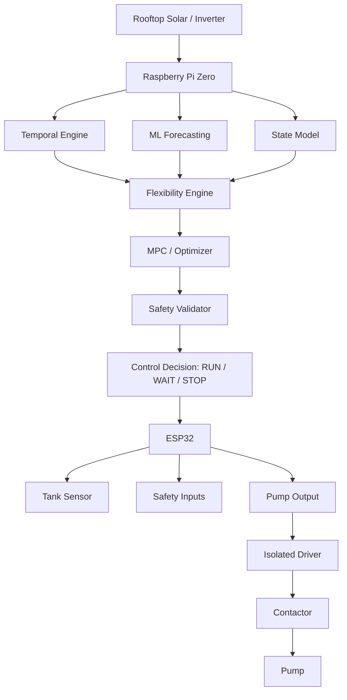

# SuryaSync

**A solar-aware residential flexible-load scheduling system.**

SuryaSync learns temporal household behaviour, forecasts future service demand and rooftop solar availability, quantifies the flexibility of controllable loads, and schedules those loads using uncertainty-aware Model Predictive Control (MPC).

> **The relay is not the innovation. The decision about when that relay should operate is the innovation.**

The current physical validation platform is an ordinary household overhead water tank + pump — used as the first testbed for a load-flexibility scheduling framework intended to generalize to washing machines, geysers, EV chargers, battery charging, and HVAC.

---

## The Core Idea

A household's real requirement is *"maintain sufficient water availability,"* not *"run the pump the instant level drops below X."* That gap between the two is **temporal flexibility** — and it can be exploited to shift electrical consumption toward periods of solar surplus without ever compromising the household service.

```text
Tank level: 47%      Expected demand before noon: low
Current solar: low   Expected solar at 11:30: high
Tank remains safe until 14:00

Decision: WAIT
→ At 11:30, solar surplus becomes sufficient → Decision: RUN
```

## Algorithm

```text
Observe
  → Build temporal context
  → Forecast household demand
  → Forecast solar generation
  → Forecast base electrical load
  → Estimate uncertainty
  → Predict future physical (tank) state
  → Quantify flexibility
  → Optimize schedule (MPC, receding horizon)
  → Validate hard safety constraints
  → Execute first action only
  → Observe again, re-optimize
```

**ML answers:** *what is likely to happen* (demand, solar, uncertainty).
**MPC/optimizer answers:** *what should happen now* (RUN / WAIT / STOP).
These layers are kept strictly separate.

## System Architecture



**Raspberry Pi Zero** — intelligence & scheduling: forecasting, uncertainty, flexibility estimation, MPC, logging, API.
**ESP32** — real-time hardware interface & local safety node: sensor sampling/filtering, pump control, heartbeat, local failsafe. No scheduling logic runs here by design.

## Status

Actively in development, following a 16-phase roadmap (see [`ROADMAP.md`](ROADMAP.md)).

| Phase | Description | Status |
|---|---|---|
| 0 | Architecture, interfaces, config, DB schema | ✅ Complete |
| 1 | Simulator (tank, pump, demand, solar, grid) | ✅ Complete |
| 2 | Conventional threshold control, safety layer, control loop | ✅ Complete |
| 3 | Solar-reactive control | 🚧 Next |
| 4–16 | Temporal learning → ML → MPC → hardware → frontend | ⬜ Not started |

The first scheduler exists as of Phase 2: a conventional threshold
controller, which is the **baseline** every later phase has to beat, not the
contribution. It runs the four standard scenarios over three simulated days
with zero hard-constraint violations. It ignores solar entirely — the gap
between its grid consumption and the later tiers' is the number this project
is arguing about.

## Repository Structure

```text
surya_sync/
├── hardware/     # ESP32 serial interface, command protocol
├── state/        # System state management
├── temporal/     # Time-aware feature engineering
├── ml/           # Demand, solar, base-load forecasting + uncertainty
├── models/       # Physical models: tank, pump, flexibility
├── control_loop.py  # One cycle: safety → scheduler → safety. Shared by
│                 # the simulator and, in Phase 11, by the ESP32.
├── scheduler/    # Threshold → reactive → heuristic → MPC (shared interface)
├── safety/       # Rule-based safety layer (runs before scheduler)
├── storage/      # SQLite persistence
├── analytics/    # Metrics, controller comparison
├── simulator/    # Simulated tank/solar/demand for algorithm dev
├── experiments/  # Reproducible experiment runner
├── api/          # FastAPI backend
├── frontend/     # Minimal monitoring/explainability UI
└── tests/
```

## Data Integrity

Results in this repo are explicitly labeled as **Measured**, **Simulated**, **Predicted**, or **Estimated**. Simulation results are never presented as physical results.

## Running Locally

Requires Python 3.11+ (for `tomllib`). Still **no third-party runtime
dependencies** as of Phase 2 — deliberately, since everything eventually runs
on a Pi Zero. ML, solver, serial and API libraries are declared as optional
extras, gated to the phases that need them.

```bash
python3 -m venv .venv
.venv/bin/pip install -e ".[dev]"

.venv/bin/python -m surya_sync.main --show-config     # resolved config + hash
.venv/bin/python -m surya_sync.main --init-db         # create SQLite schema
.venv/bin/python -m surya_sync.main --run-scenarios   # drive the simulator
.venv/bin/python -m pytest                            # test suite
```

`--run-scenarios` prints Phase 2's result. Every figure in it is **simulated**:

```text
SIMULATED results — not physical measurements
config_hash 5eaacb93c063fc88   step 15 min
scenario    viol  unmet_L  spill_L  starts  pump_kWh  grid_kWh  solar_%
sunny          0      0.0      0.0       3      0.56      0.00    100.0
cloudy         0      0.0      0.0       3      0.56      0.51      9.2
spike          0      0.0      0.0       4      0.94      0.38     60.0
low_start      0      0.0      0.0       4      0.75      0.75      0.0
```

The threshold controller never looks at the sun, so `sunny`'s 100% is luck:
its refill happens to land at 16:00. That is why Phase 3 is judged on
`cloudy`, `low_start` and the aggregate, not on the easy case.

The schema moved to v2 in Phase 2. A `data/surya_sync.db` written under v1 is
refused rather than migrated in place — delete it and re-run `--init-db`.

Configuration lives in [`surya_sync/config/default.toml`](surya_sync/config/default.toml).
Copy it and pass `--config path/to/your.toml` for a real deployment rather than
editing the packaged defaults. Every resolved config is hashed, and the hash is
recorded with each run so any result traces back to the exact parameters that
produced it.

### Simulator quickstart

Run one of the four standard scenarios through the real controller, with the
safety layer and the fallback chain in place. This is the same
`ControlCycle` the ESP32 will drive in Phase 11 — not a simulation-only
shortcut. Its numbers are **simulated**, not measured.

```python
from surya_sync.config.schema import Config
from surya_sync.experiments.runner import run_scenario
from surya_sync.scheduler.threshold import ThresholdScheduler
from surya_sync.simulator import scenarios

config = Config()
scenario = scenarios.cloudy(config, days=3)     # or sunny / spike / low_start
run = run_scenario(config, scenario, ThresholdScheduler(config.scheduler))

print(f"pump runtime     {sum(s.minutes for s in run.steps if s.actuator_on):.0f} min")
print(f"pump energy      {run.pump_energy_kwh:.2f} kWh "
      f"(grid {run.grid_energy_kwh:.2f} / solar {run.solar_energy_kwh:.2f})")
print(f"pump starts      {run.starts}")
print(f"unmet demand     {run.unmet_demand_l:.1f} L")
print(f"hard violations  {len(run.violation_steps)}")
print(f"safety overrides {run.safety_overrides}")

first = run.decisions[0].plan.explanation          # what the "Why?" screen renders
print(first.to_dict())
```

Re-running this reproduces the trajectory exactly; the profiles are pure
functions of time rather than random streams, so experiments replay.

Two things the simulator is built to make visible rather than hide:
overflow and unserved demand are reported as quantities (`spilled_l`,
`unmet_demand_l`) instead of being absorbed by clamping the tank volume, and
the pump is credited only with surplus PV left after the base household load,
so a scheduler cannot book the fridge's solar as its own.

## License

TBD — add a `LICENSE` file (MIT recommended for portfolio visibility).
